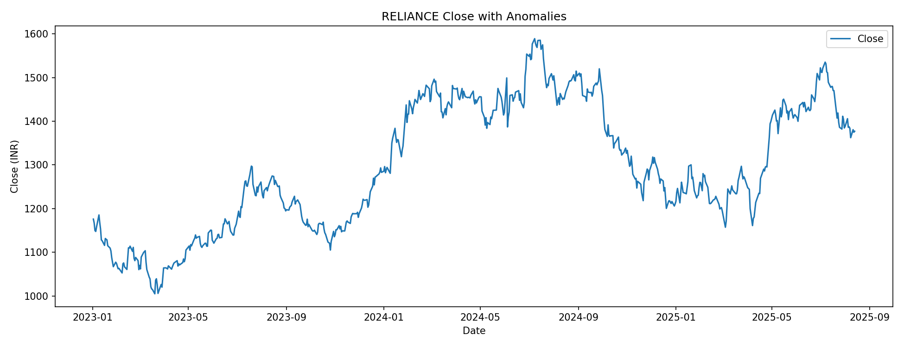

# 📈 Market Manipulation Detection Using Volume-Price Anomalies

## 📝 Project Overview
This project detects **potential market manipulation** in stock price data by identifying unusual patterns in **trading volume** and **price changes**.

The assumption is that **sudden, abnormal changes in volume combined with large price movements** may signal activities like pump-and-dump schemes, insider trading, or other irregularities.

For demonstration, this project analyzes historical stock data for **Reliance Industries Ltd.** (NSE) and flags any days where anomalies occur.

---

## 📊 Key Features
- ✅ Automated anomaly detection using **intraday returns** & **volume spikes**
- 📂 Saves results in `outputs/` folder
- 📈 Generates visual anomaly charts in `charts/` folder
- 🗂️ Fully reproducible **Jupyter Notebook** (`analysis.ipynb`)
- 📦 `requirements.txt` for easy environment setup
- ☁️ **Google Colab button** to run the project online without installation

---

## 📂 Project Structure

Market-Manipulation-Detection/
│
├── data/
├── outputs/
├── charts/                
│   ├── anomalies_chart.png
│   ├── price_volume_chart.png
│
├── README.md
├── requirements.txt
├── analysis.ipynb

---

## 🖼 Project Screenshots
| Anomaly Detection Chart | Price vs Volume Chart |
|-------------------------|-----------------------|
|  |  |

---

## 🚀 How to Run This Project

### **Option 1: Run on Google Colab (Recommended)**
Simply click the **"Open in Colab"** button at the top of this README.  
No installation is required — runs directly in your browser.

---

### **Option 2: Run Locally**

1️⃣ **Clone the repository**  

git clone https://github.com/Souvik2730/market-manipulation-detection.git
cd market-manipulation-detection

2️⃣ Create a virtual environment: 
python -m venv venv

3️⃣ Activate the environment

Windows PowerShell:
venv\Scripts\Activate.ps1

Mac/Linux:
source venv/bin/activate

4️⃣ Install dependencies: 
pip install -r requirements.txt

5️⃣ Run Jupyter Notebook

6️⃣ Open analysis.ipynb and Run All Cells.

---

## 📈 Methodology

### 1. Data Collection
- Download historical stock data (NSE: Reliance Industries Ltd.).

### 2. Data Preprocessing
- Convert date columns to datetime format.
- Sort chronologically.
- Remove missing values.

### 3. Feature Engineering
- Calculate **intraday return percentage**.
- Detect **volume spikes** using mean & standard deviation thresholds.

### 4. Anomaly Detection
- Flag days with both unusual volume and large price change.

### 5. Visualization
- Plot anomalies on a price chart.

---

## 📊 Example Output
- **Number of anomaly days detected:** 0  
- **Charts generated:** Stored in `charts/` folder  
- **CSV results:** Stored in `outputs/anomalies_detected.csv`

---

## 🛠️ Technologies Used
- **Python 3.9+**
- **Pandas** – Data handling
- **Matplotlib** – Visualization
- **Jupyter Notebook** – Interactive analysis

---

## 📜 License
This project is licensed under the **MIT License** – feel free to use and modify with attribution.

---

## 🙋‍♂️ Author
**Souvik Ghorui**  
📧 Email: ghoruisouvik7@gmail.com  
🔗 LinkedIn: (https://www.linkedin.com/in/souvik-ghorui273/)  
💻 GitHub: (https://github.com/Souvik2730)  

---

## ⭐ How to Support
If you found this project helpful, please **star this repository** on GitHub.  
Your support motivates me to create more projects!

